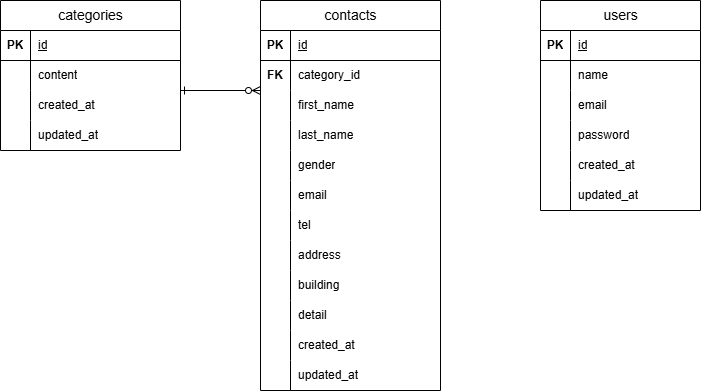

# お問い合わせフォームアプリ

## 環境構築

### Dockerビルド

1. リポジトリをクローン
git clone https://github.com/rararamonkey/test-contact-form.git

2. プロジェクトフォルダに移動
cd test-contact-form

3. Dockerコンテナをビルド
docker-compose up -d --build

---

## Laravel環境構築

1. PHPコンテナに入る
docker-compose exec php bash

2. Composerインストール
composer install

3. .envファイルを作成
cp .env.example .env

4. アプリケーションキー作成
php artisan key:generate

5. マイグレーション実行
php artisan migrate

---

## 使用技術

- PHP 8.0
- Laravel 8.x
- MySQL 8.0
- nginx
- Docker

---
 
## ER図

---

## URL

- 開発環境：http://localhost/